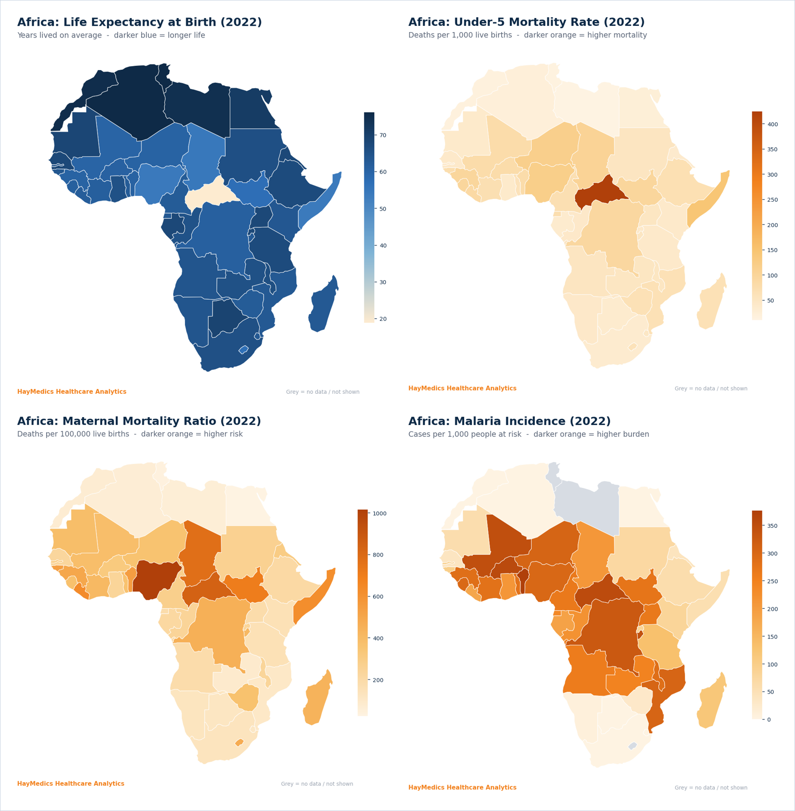
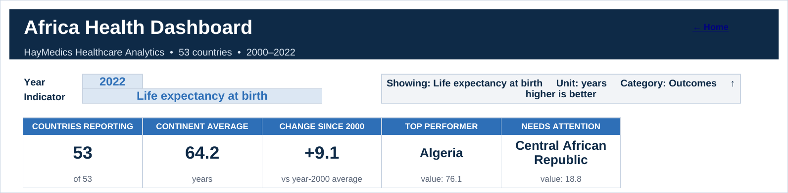
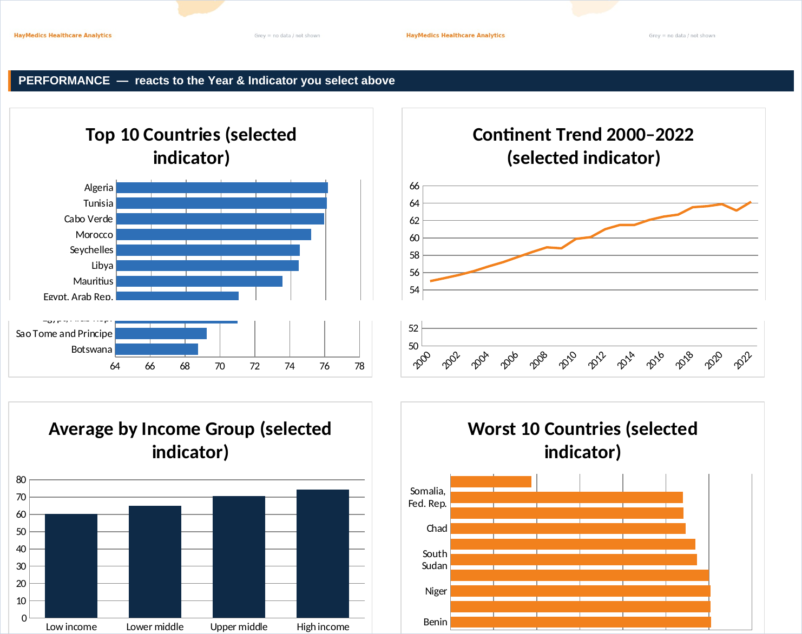
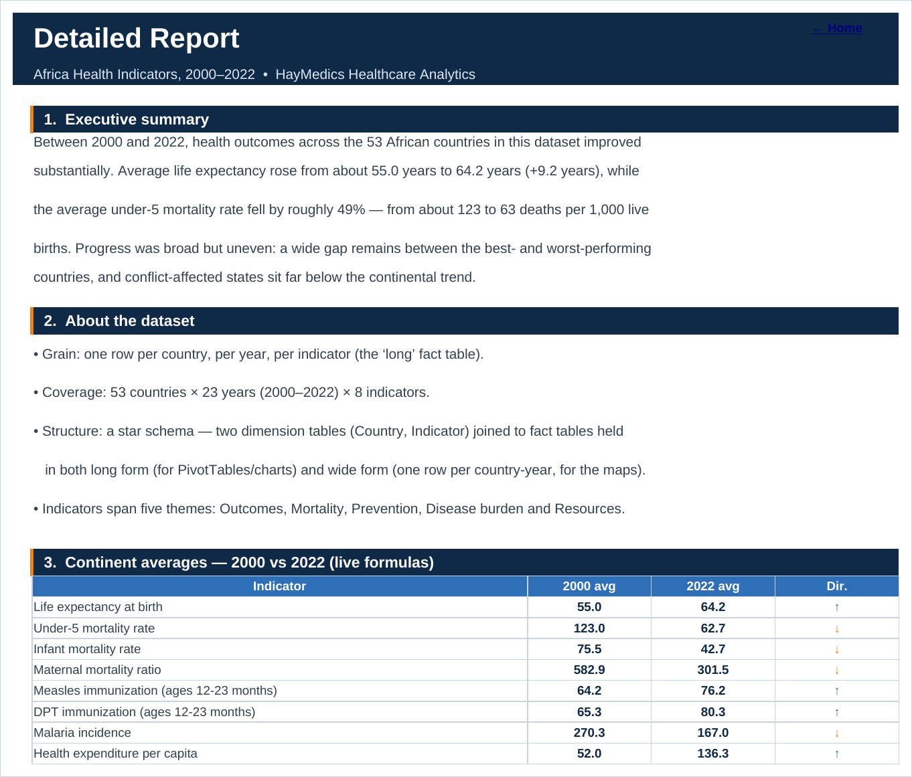
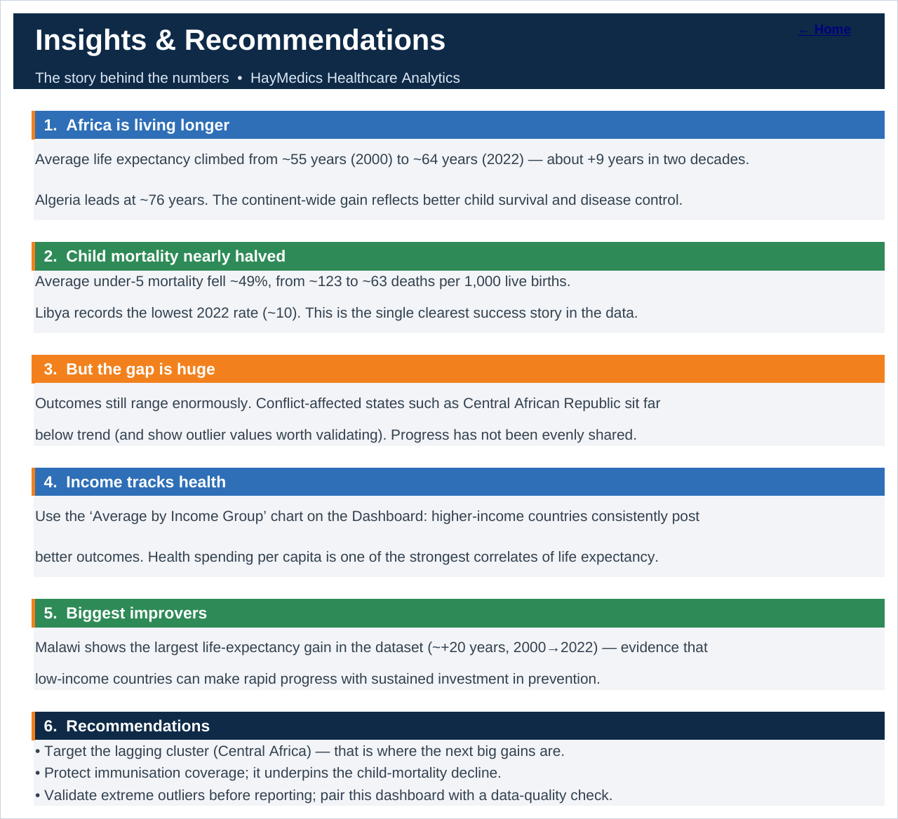

# 🌍 Africa Health Dashboard — HayMedics Healthcare Analytics

> An interactive Excel dashboard exploring public-health outcomes across **53 African countries (2000–2022)**, built on a clean star-schema dataset with live formulas, four geographic choropleth maps, and a written report & insights pack.


---

## 📌 Overview

This project turns a raw health dataset into a **decision-ready dashboard**. A user picks a **Year** and an **Indicator** from two drop-downs, and every KPI card, chart and ranking updates instantly using live Excel formulas — nothing is typed by hand.

The dataset covers **8 health indicators** across five themes (Outcomes, Mortality, Prevention, Disease burden, Resources), modelled as a **star schema**: two dimension tables (Country, Indicator) joined to fact tables held in both *long* and *wide* form.

---

## 🖼️ The four maps

The headline of the dashboard is a 2×2 grid of **Africa choropleth maps** for 2022 — so country-to-country variation is visible at a single glance.



| Map | Reads as | Pattern in 2022 |
| --- | --- | --- |
| **Life expectancy** (blue) | darker = longer life | Highest in North Africa (Algeria ~76 yrs); lowest in Central Africa |
| **Under-5 mortality** (orange) | darker = higher | Broadly the inverse of life expectancy |
| **Maternal mortality** (orange) | darker = higher risk | Continent average roughly halved since 2000; highest in Nigeria (~1,016) |
| **Malaria incidence** (orange) | darker = higher burden | Concentrated in West & Central Africa; non-endemic countries shown grey |

> **Design choice:** one blue scale for the “good” indicator and a shared orange scale for the three “bad” indicators, so a viewer never has to re-learn the colours when moving between maps.

---

## 📊 The interactive dashboard



**KPI cards** (all live formulas):
- Countries reporting · Continent average · Change since 2000 · Top performer · Needs attention

The **Top performer** and **Needs attention** cards are *direction-aware*: for a “good” indicator like life expectancy the leader is the **highest** value (Algeria), but switch to under-5 mortality and it automatically flips to the **lowest** value (Libya). This uses a direction-aware `RANK` with `INDEX/MATCH`.

**Four reactive charts:**



- 🏅 **Top 10 countries** for the selected indicator (blue)
- 🚩 **Worst 10 countries** — the lagging end, mirrored for comparison (orange)
- 📈 **Continent trend** 2000–2022
- 💰 **Average by income group** (low → high income)

---

## 📄 Report & 💡 Insights

A written **Report** sheet explains the dataset, methodology, what each map shows, and honest data-quality notes — with a live 2000-vs-2022 comparison table.



An **Insights** sheet turns the numbers into a story for stakeholders, plus recommendations.



---

## ✨ Key features

- ✅ **Two drop-down filters** (Year, Indicator) driving the whole dashboard
- ✅ **5 live KPI cards** with direction-aware “best / worst” logic
- ✅ **Four Africa choropleth maps** (life expectancy, under-5 mortality, maternal mortality, malaria)
- ✅ **4 reactive charts** (top 10, worst 10, time trend, income comparison)
- ✅ **Star-schema data model** (dimensions + long & wide fact tables)
- ✅ **Detailed Report + Insights** sheets, recruiter-ready
- ✅ **Zero formula errors** across 300+ formulas
- ✅ Consistent **HayMedics navy / blue / orange** branding

---

## 🗂️ Repository structure

```
haymedics-africa-health-dashboard/
├── README.md
├── LICENSE
├── UPLOAD_GUIDE.md                 ← step-by-step GitHub upload (web interface)
├── .gitignore
├── dashboard/
│   └── HayMedics_Africa_Health_Dashboard.xlsx
├── data/
│   ├── dim_country.csv             ← country dimension (region, income, lat/long)
│   ├── dim_indicator.csv           ← indicator dimension (unit, category, direction)
│   ├── fact_health_long.csv        ← tidy facts: iso3 · year · indicator · value
│   └── fact_health_wide.csv        ← one row per country-year (used for the maps)
└── screenshots/
    ├── maps_grid.png
    ├── dashboard_top.png
    ├── charts.png
    ├── report.png
    ├── insights.png
    └── map_*.png                   ← the four maps individually
```

---

## 📚 Data dictionary (indicators)

| Code | Indicator | Unit | Category | Better when |
| --- | --- | --- | --- | --- |
| SP.DYN.LE00.IN | Life expectancy at birth | years | Outcomes | ↑ higher |
| SH.DYN.MORT | Under-5 mortality rate | per 1,000 live births | Mortality | ↓ lower |
| SP.DYN.IMRT.IN | Infant mortality rate | per 1,000 live births | Mortality | ↓ lower |
| SH.STA.MMRT | Maternal mortality ratio | per 100,000 births | Mortality | ↓ lower |
| SH.IMM.MEAS | Measles immunization (12–23 mo) | % of children | Prevention | ↑ higher |
| SH.IMM.IDPT | DPT immunization (12–23 mo) | % of children | Prevention | ↑ higher |
| SH.MLR.INCD.P3 | Malaria incidence | per 1,000 at risk | Disease burden | ↓ lower |
| SH.XPD.CHEX.PC.CD | Health expenditure per capita | current US$ | Resources | ↑ higher |

---

## ▶️ How to use

1. Download `dashboard/HayMedics_Africa_Health_Dashboard.xlsx`.
2. Open it in **Microsoft Excel** (drop-downs and live formulas need desktop Excel).
3. On the **Dashboard** sheet, change the **Year** and **Indicator** drop-downs.
4. Watch the KPI cards, charts and rankings update. Use the **Home** sheet to navigate.

---

## 🛠️ How it was built

- **Excel** — data model, drop-downs (data validation), KPI cards and charts driven by `AVERAGEIFS`, `RANK`, `INDEX/MATCH`.
- **Python** (`matplotlib`, `openpyxl`) — rendered the four choropleth maps from country boundary data and the official **ISO-3** codes, and assembled the workbook programmatically.
- **Star-schema modelling** — dimensions + long/wide fact tables for clean, reusable joins.

---

## 🎯 Skills demonstrated

- Dimensional data modelling (star schema)
- Dynamic Excel: `AVERAGEIFS`, `RANK`, `INDEX/MATCH`, data-validation drop-downs
- Interactive KPI cards & charts that react to user selection
- Geographic data visualisation (choropleth maps)
- Clear data-quality reasoning and stakeholder-ready reporting

---

## ⚠️ Data note

This dataset is **illustrative** and intended for portfolio demonstration. A few values are clear outliers (e.g. Central African Republic’s 2022 figures) and would be validated against authoritative sources such as the **WHO** or **World Bank** before any real-world use. The dashboard intentionally flags this in its Data-quality section — good analyst practice.

---

## 👤 Author

**HayMedics Healthcare Analytics** — Data Analytics Portfolio
_https://www.linkedin.com/in/awal-abdulrahman-md-a53483219_

⭐ If you find this useful, consider starring the repo.
